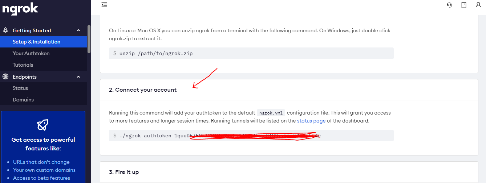
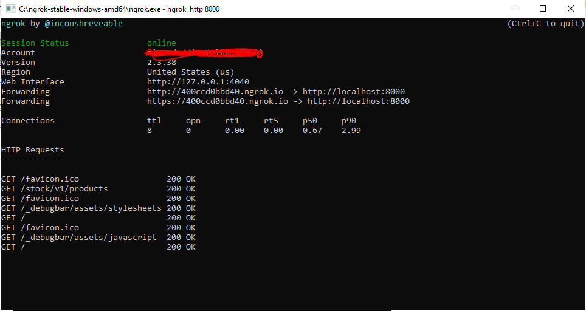

### วิธีติดตั้ง
1. clone project
```git clone https://github.com/nirusduddinmateh/restful-api.git```
2. เมื่อ clone เสร็จแล้วให้เข้าไป folder project คลิกขวา เลือก Git Bash Here
3. รันคำสั่ง ```composer update```
4. ให้สร้างฐานข้อมูลชื่อ restful_db ผ่าน phpMyAdmin หรือ อื่นๆ ที่สามารถสร้างฐานข้อมูลได้
5. รันคำสั่ง ```copy .env.example .env``` ***Windows หรือ ```cp .env.example .env```
6. รันคำสั่ง ```php artisan migrate``` เพื่อสร้างตารางข้อมูล หรือ ```php artisan migrate:refresh``` สำหรับคนที่ใช้ฐานข้อมูลเดิม
7. รันคำสั่ง ```php artisan db:seed``` เพื่อสร้างตัวอย่างข้อมูล
8. รันคำสั่ง ```php artisan jwt:secret``` เพื่อสร้าง Jwt Key
9. รันคำสั่ง ```php artisan storage:link``` เพื่อสร้าง symlink
10. รันคำสั่ง ```php artisan serve```


### ติดตั้ง Ngrok
####***ต้องสมัครสมาชิก ก่อนใช้งาน
1. ทำการดาวน์โหลด Ngrok โดยการเข้าไปที่ https://ngrok.com/download และทำการเลือก Windows (รูปภาพที่ 10 ดาวน์โหลด Ngrok บน Windows)
2. ทำการ Unzip ไฟล์และทำการเปิดโปรแกรมโดยการ คลิกขวา เลือก Run as administrator จะปรากฏหน้าต่าง Ngrok (รูปภาพที่ 11 การเปิดโปรแกรม Ngrok)
3. เชื่อมต่อกับบัญชี ไปดูได้ที่ https://dashboard.ngrok.com/status ตรงหัวข้อ Connect your account
   
   
4. ใช้คำสั่งเพื่อทำการสั่งเริ่มต้นรันโปรแกรม โดยที่เลขที่ต่อท้ายคำสั่งคือเลขของค่า Port นั่นเอง 
   ใช้คำสั่ง (เริ่มต้นโปรแกรม Ngrok บน Windows)
   ```ngrok http 8000```
   

5. ทดสอบเข้าใช้งานโดยเข้าจาก URL ที่ปรากฏบน Terminal หรือเข้าดูได้จาก https://dashboard.ngrok.com/status
